# Integrated fact model and flow

## Entrance + utility package

One project can produce an Entrance Permit together with any applicable utility outcome: a Utility Construction Permit, Utility Safety Permit, After-the-Fact Emergency Utility Permit, or one or more Small Wireless Facility Permits. Contact, project, site, construction-impact, and GIS facts are stored once and consumed by all applicable rule sets.

With `/entrancePermitRequested = true`, the graph derives both permit outcomes, entrance traffic requirements, separate document completion states, and `/crossPermitCoordinationRequired` when underground utility work affects the entrance site. `/applicationComplete` becomes true only when every requested permit is complete.

## Diagram

```mermaid
flowchart LR
  ACT["Activities + utility subtype"] --> DET["Front-loaded determining facts<br/>emergency · jurisdiction · disturbance<br/>traffic · duration · wireless count"]
  DET --> DONE["permitPackageDetermined<br/>askUtilityDeterminationQuestions<br/>askWirelessDeterminationQuestions"]
  DONE --> TYPES["Explicit needed facts<br/>utilityConstructionPermitNeeded<br/>utilitySafetyPermitNeeded<br/>emergencyUtilityPermitNeeded<br/>smallWirelessPermitsNeeded + count<br/>entrancePermitNeeded"]
  TYPES --> MANIFEST["Graph-derived question manifest<br/>askShared · askSite · askUtility<br/>askWireless · askEntrance · askDocuments"]
  MANIFEST --> DETAILS["Applicant, site, permit, and node facts"]
  DETAILS --> DOCS["Derived document requirements"]
  DOCS --> COMPLETE["applicationComplete"]
  COMPLETE --> READY["readyToSubmit"]
```



The editable, detailed version is in [`fact-model.mmd`](fact-model.mmd).

## Record shape

```text
Application package (project)
├── application type
├── project name
├── shared applicant / contact
├── project/entrance site (0..1)
│   └── address + county + latitude/longitude + GIS facts
├── utility application (0..1, no fee)
├── entrance application (0..1, no fee)
└── wireless nodes (0..n)
    ├── reuse project site OR provide a distinct location
    └── node = one permit application + $100 fee
```

The package is the user-facing draft and checkout unit. Each wireless node remains a separate application record for eligibility, documents, review, identifiers, and transmission to EUS.

Documents are collection records rather than one fact per upload type. `/documents` contains project- and permit-scoped records; every wireless site has its own `/sites/*/documents` collection. Each record has a typed document kind, one writable `attached` fact, and graph-derived scope, permit consumers, and `required` status. Completion compares the count of required records with the count of required-and-attached records. Project documents, such as the Authorized Agent Form, are therefore uploaded once, while node documents are independently required for each node.

The entrance is project-scoped, not node-scoped. The applicant supplies every wireless node first, then one entrance fact set. A node at the entrance/project site sets `/sites/*/usesProjectSiteLocation = true`; its effective address, county, latitude, longitude, and GIS facts are reused from that site. Only a node at a different location asks for another complete location record.

## POC rule provenance

The fact graph is the executable source for document triggers and their displayed explanations. The inspector's “View graph trace” exposes the exact required-by fact and reason fact for each document. Some business rules in this proof of concept are modeling assumptions inferred from the supplied forms rather than confirmed DelDOT policy; graph derivation makes those assumptions traceable, but does not make them authoritative. They must be validated with DelDOT before production use.

## Derived decisions

| Derived fact | Inputs | Result |
|---|---|---|
| Permit path | application type, emergency, jurisdiction, disturbance, traffic impact, duration | Construction, Safety, Emergency, Small Wireless, or no permit |
| Small wireless qualification | largest antenna volume, other equipment volume | Block when antenna is over 6 cu. ft. or other equipment is over 28 cu. ft. |
| Wireless height eligibility | pole height, highest facility elevation | Block when facility exceeds the greater of pole + 10 ft. or 50 ft. (simplified POC gate) |
| Traffic Control Plan required | TA count and major traffic conditions | Require at 5+ TAs or a qualifying traffic impact |
| Required documents | filing party, ownership, construction, sensitive areas, traffic control | Node- or utility-specific checklist |
| Amount due | application type, wireless node count | Utility: $0; wireless: node count × $100 |
| Required answers complete | every relevant writable fact | True only when all applicable answers are present and valid |
| Application complete | shared facts, application/node facts, derived documents | True when the complete application record can be assembled |
| Ready to submit | application complete, eligibility, documents, attestations | Sole fact used to enable submission |

The browser does not use HTML `required` validation. Every displayed requirement now names a real dictionary path, and aggregate completion and submission readiness come from the graph. The inspector reads the engine's explanation tree rather than reimplementing permit rules in JavaScript. Blank material questions remain unknown until the applicant visits and answers the applicable screen.

General utility permit identity is represented by `/utilityPermitIdentity`, an enum (`construction`, `safety`, `emergency`, or `none`). The applicant-facing `/utilityPermitType` label is derived from that identity. Navigation and the five explicit `*PermitNeeded` facts consume the enum, so changing display copy cannot change routing. `/generalUtilityExcluded` independently records that reported utility work produced no permit, including when another activity still produces an Entrance or Small Wireless permit.

For small wireless, the requested permit type and node eligibility are separate. Selecting small wireless establishes the requested permit as a Small Wireless Facility Permit. Missing or disqualifying equipment and height answers affect only that node’s `/permitEligible` fact and the all-node aggregate; they do not change the requested permit type.

The source specification contains a historical-pole height exemption and nearby-pole comparison. Those require GIS/inventory facts not present in the supplied inputs, so the POC exposes the conservative simplified height gate and leaves those integrations for production.

## Applicant flow

```text
Choose project activities and utility subtype
  → answer every permit-determining question
  → graph identifies the complete permit package and wireless permit count
  → graph exposes the question groups required to complete that package
  → shared contact + project facts
  → shared site facts when required
  → utility application details when a Construction, Safety, or Emergency permit is required
  → wireless: complete overview → construction for each declared node
  → one entrance detail set when an Entrance Permit is required
  → graph-derived documents
  → review entire package
  → one checkout for $100 × wireless nodes (other permits have no application fee)
  → transmit application record(s) to EUS
```

Shared applicant facts carry forward. Location, equipment, construction, traffic control, documents, and attestations are node-specific and do not carry between wireless nodes. Navigation is a projection of collection completeness: it can be sequential, tabbed, or resumed at any incomplete node without changing the fact model.

The interface deliberately does not advertise a fixed list of future sections. The graph can add or remove questions when an answer changes without making the navigation misleading. Technical graph state and consequences remain available in the optional floating inspector rather than appearing as applicant-facing progress labels.

## Production boundaries

- GIS should supply jurisdiction, state maintenance, limited-access roads, municipality, speed, railroad proximity, airport airspace, cemetery proximity, and active-project facts.
- Authentication should supply agreement-holder and contact facts.
- Uploaded files need durable document IDs associated with either the package or a specific application/node.
- Payment needs an idempotent package transaction that allocates `$100` to each wireless application before all records are transmitted.
- The app should persist graph values server-side; browser local storage is only used for this demonstration.
